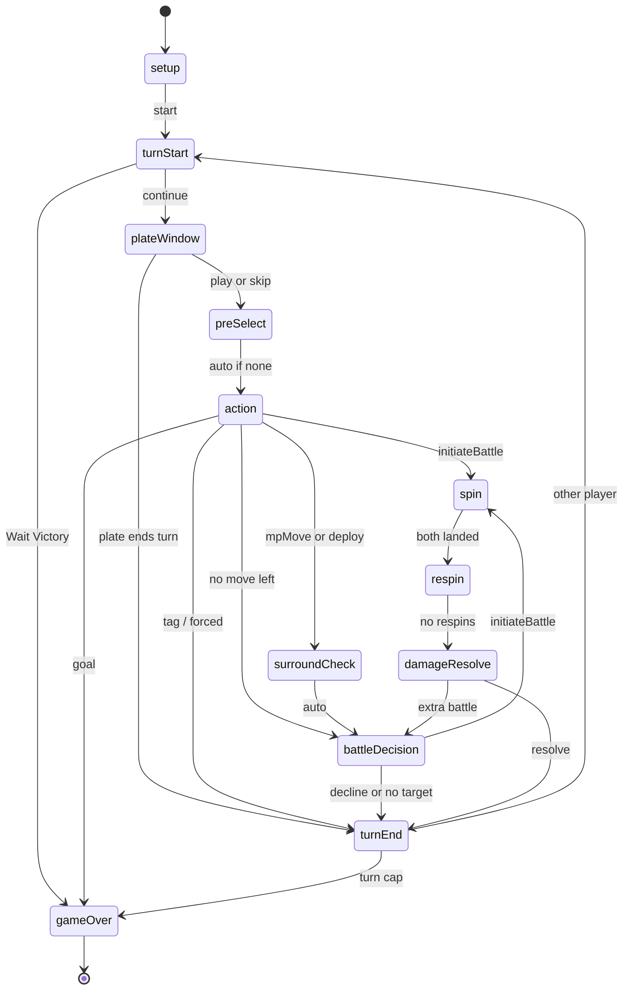

# Pokémon Duel 2D

`npm run dev`, then open `/3d` (player table) or `/dev` (debug client). Vite serves on port 5173. `npm run storybook` previews the Three.js assets locally on port 6006.

GitHub Pages hosts the static Vite build at [`/podu-2d/3d`](https://devadula-nandan.github.io/podu-2d/3d) and Storybook at [`/podu-2d/storybook/`](https://devadula-nandan.github.io/podu-2d/storybook/). Two-player rooms need a later host — they will not work on Pages. vs-AI and the local engine still run in the tab.

## Content

Figure stats live in `data/figures/` (one JSON per figure). Run `npm run data:build` to import them into `data/content/figures.json` + `abilities.json` and validate. Plates stay in `data/content/plates.json`.

## Turn phase machine

From `src/engine/state.ts` (`Phase`) and `src/engine/phases.ts` (`settle`). Waiting phases: `plateWindow`, `action`, `battleDecision`, `spin`, `respin`. The rest hop automatically. `surroundCheck` is a real phase but only forwards to `battleDecision` — surround/goal already ran in `afterMovement`. This mermaid is the short documented subset (`PHASE_MACHINE_MERMAID`). The `/dev` Machine tab renders the complete `PHASE_MACHINE_NODES` / `PHASE_MACHINE_EDGES` graph.

**Don't battle** is only the optional post-move fight (`declineBattle`). Action has no pass; skip-plate is `declinePlate` in `plateWindow`. After an MP-walk or deploy, plates stay closed and only that figure may battle (`movedUid`); if it has no adjacent target the turn ends. Surround can KO and deny a goal. Concede and the chess clock can end the duel from any waiting phase.
