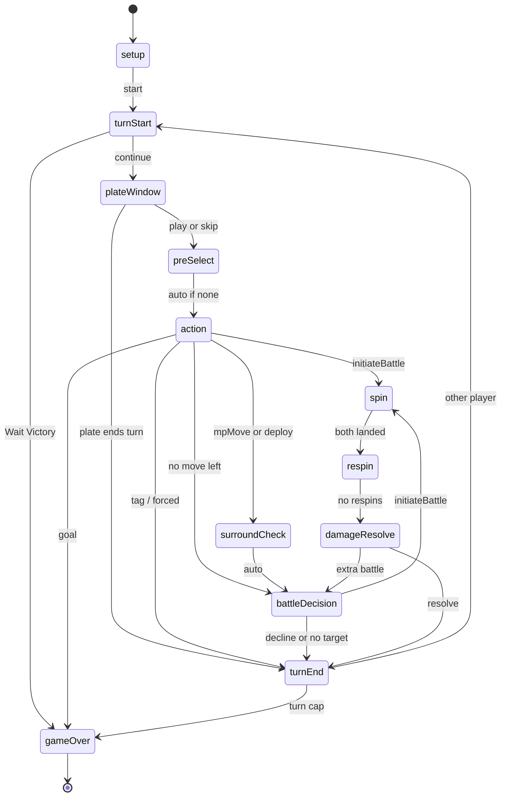

# Pokémon Duel 2D

`npm run dev`, then open `/2d` (player table) or `/dev` (debug client). Vite serves on port 5173.

GitHub Pages hosts the static Vite build (open `/2d` on that site). Two-player rooms need a later host — they will not work on Pages. vs-AI and the local engine still run in the tab.

## Turn phase machine

From `src/engine/state.ts` (`Phase`) and `src/engine/phases.ts` (`settle`). Waiting phases: `plateWindow`, `action`, `battleDecision`, `spin`, `respin`. The rest hop automatically. `surroundCheck` is a real phase but only forwards to `battleDecision` — surround/goal already ran in `afterMovement`. The same graph is `PHASE_MACHINE_MERMAID` in `src/engine/phase-machine.ts` and the live `/dev` Machine tab (keep those in sync).

**End turn** is only the optional post-move battle (`declineBattle`). Action has no pass; skip-plate is `declinePlate` in `plateWindow`. Plates close when that window ends. After `mpMove`, plates stay closed and other figures lock (`movedUid`). Surround can KO and deny a goal. Concede and the chess clock can end the duel from any waiting phase.
